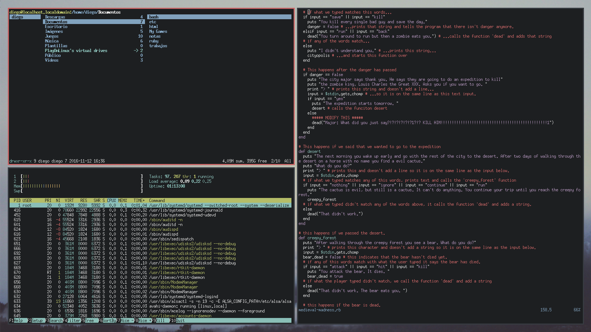

# dotfiles

IIFO's dotfiles

**Required applications**

 - [i3-gaps](https://github.com/Airblader/i3)
 - [screenfetch](https://github.com/KittyKatt/screenFetch)
 - [nitrogen](http://projects.l3ib.org/nitrogen/)
 - [urxvt](http://software.schmorp.de/pkg/rxvt-unicode) (link currently broken)
 - dmenu

**Colorscheme:** [Tomorrow](https://chriskempson.github.io/base16/#tomorrow)
 

